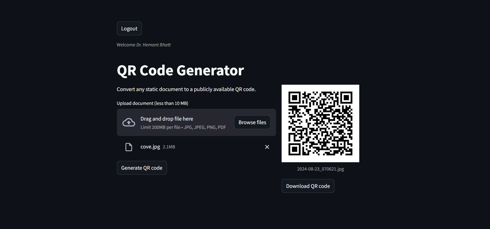

# QR Code generator

Static document QR code generator. Get in touch to try it out.

- **Blob Storage** : Firebase
- **Webapp Stack** : Python (FastApi)
- **Backend Hosting** : Vercel
- **Frontend Stack** : Python (Streamlit)

## Screenshots

## Troubleshooting

- [Firebase Console](https://console.firebase.google.com/u/1/project/qr-code-generator-f0b11/overview)
- [Vercel Console](https://vercel.com/saumyabhatts-projects/qr-code-generator)

### Helpful References

1. [Adding service account to vercel](https://dev.to/vvo/how-to-add-firebase-service-account-json-files-to-vercel-ph5)
2. [FastAPI with Vercel](https://dev.to/mihaiandrei97/building-a-fastapi-application-and-deploying-it-with-vercel-ho7)
3. [Remove line-breaks from JSON](https://www.textfixer.com/tools/remove-line-breaks.php?__cf_chl_tk=4f6nwQFGJvELIXDn3NUVFO7oqsUErM5r8ULgkVqDEfk-1724376259-0.0.1.1-8425)
